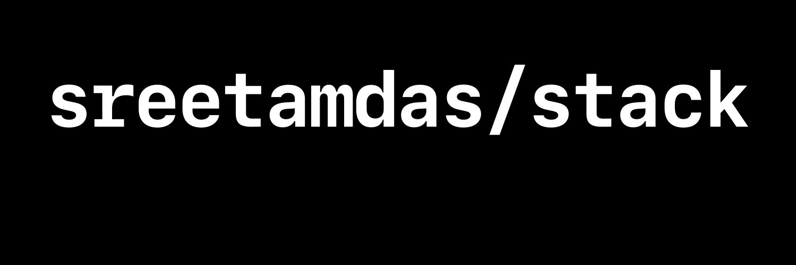

<!-- # stack -->

<h5 align="center">
	A modern-day-tech stack boilerplate with <code>React, TypeScript, Styled-Components, Webpack, ESLint, Babel</code> and <a href="#tooling">other tooling</a>
</h5>

### [Tooling](#tooling)

-   commitlint
-   lint-staged
-   husky
-   prettier
